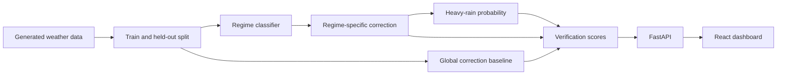

# MeghSetu

**Regime-aware rainfall forecast correction for India**  
SIH 2026 · Problem SIH26080

MeghSetu is our student project for exploring one question: can rainfall forecasts be improved when the correction takes the current weather pattern into account?

The app walks through that idea from start to finish. It creates a small India-focused weather dataset, labels each grid point with a weather regime, corrects the raw rainfall forecast, estimates the chance of heavy rain, and compares the results with held-out samples. The dashboard lets you explore those outputs on a map and through a few model and verification views.

> **A note about the results:** MeghSetu currently runs on generated sample data. The rainfall values and scores are for demonstrating the software and model workflow; they are not live forecasts, measured observations, or evidence of real-world forecast skill.

## Try it on your computer

You’ll need Python 3.10 or newer and Node.js 20 or newer. Start the API in one terminal:

```powershell
py -m venv .venv
.\.venv\Scripts\Activate.ps1
py -m pip install -r backend\requirements.txt
$env:PYTHONPATH = "$PWD\backend"
uvicorn app.main:app --app-dir backend --reload
```

Then start the website in a second terminal:

```powershell
cd frontend
npm install
npm run dev
```

Open [http://localhost:5173](http://localhost:5173). The API’s interactive docs are at [http://localhost:8000/docs](http://localhost:8000/docs).

On Linux or macOS, create the environment with `python3 -m venv .venv`, activate it with `source .venv/bin/activate`, and install the same requirements. Run the API with `PYTHONPATH=backend uvicorn app.main:app --app-dir backend --reload`; the frontend commands are the same.

No API key is needed for the sample run. The map uses OpenStreetMap tiles when the internet is available and falls back to a generated grid if it isn’t. The map points are generated too—they don’t represent observed rainfall locations.

## What to click

Choose **Run analysis** to generate the sample data, train the models, and refresh the results. From the left menu, you can then:

- compare the raw forecast with global and regime-aware corrections;
- switch rainfall map layers and inspect a grid point;
- see which weather regimes the classifier found;
- adjust the heavy-rain threshold and review the highest-risk points;
- check verification scores calculated from the held-out data.

The theme button changes the whole app between day and night appearance. **Refresh data** starts a new generated run.

## How the model works

The generator creates spatially connected rainfall patterns and atmospheric features such as humidity, CAPE, wind and elevation. It also adds different forecast errors for different weather regimes.

The pipeline holds out part of the generated data before fitting anything. A scikit-learn classifier predicts the regime. MeghSetu then compares a general correction model with separate correction models for six regimes: Active Monsoon, Break Monsoon, Monsoon Depression, Orographic Rain, Coastal Convection and Western Disturbance. A probability classifier estimates whether rainfall will exceed 64.5 mm.

The dashboard calculates the verification scores from the held-out samples. Because the data are generated, a good score here only shows that the pipeline and score calculations run—it does not show that the approach works on real monsoon forecasts.

## Project layout

```text
backend/   FastAPI app, sample-data generator and model pipeline
frontend/  React dashboard, map and charts
tests/     API smoke test and pipeline tests
data/      Data location for future sources
models/    Space for saved models
```

The project flow is:



## API quick reference

The API includes `/health`, `/metadata`, `/regimes`, `/metrics`, `/alerts`, and `/forecast/{date}`. Use `POST /generate-demo-data` or `POST /train` to create or train a run. `POST /predict` accepts one location’s inputs; `POST /predict/batch` accepts up to 500.

For example, open `/docs` while the API is running to try the endpoints in your browser. A prediction body looks like this:

```json
{
  "latitude": 22.5,
  "longitude": 82.5,
  "month": 7,
  "nwp_mm": 45,
  "humidity": 75,
  "cape": 900,
  "wind": 12,
  "elevation": 250
}
```

## Scores shown in the app

- **RMSE** and **MAE** summarize rainfall error; **bias** is forecast minus observation.
- **CSI**, **ETS**, **POD** and **FAR** score threshold-based rain detection.
- **Brier score** measures the error in heavy-rain probabilities.
- **FSS** is shown as a pointwise approximation for this sample grid, not a full neighborhood-based spatial score.

## Running checks and containers

From the project root, run `pytest tests` after installing the backend requirements. To run both services in containers, use:

```bash
docker compose up --build
```

Then open [http://localhost:5173](http://localhost:5173). `DEMO_GUIDE.md` has a short walkthrough for presenting the app.

## Using real data later

The current generator lives in `backend/app/data/`. A future data adapter could read NetCDF with xarray or Parquet with pandas, then supply the features expected by `backend/app/services/pipeline.py`. Keep rainfall units, grid coordinates, valid times and forecast lead times consistent. For a meaningful evaluation, split by time and location before training and compare against an operational baseline. The generated-data scores should not be carried over as real-world claims.

## Publishing the app

The frontend can be hosted on Vercel and the Python API on a service such as Render. The repository includes `frontend/vercel.json` and `render.yaml` for those builds. Set `VITE_API_URL` in the Vercel project to the deployed API address, then redeploy the frontend. See the deployment notes in this README’s GitHub copy or the Render and Vercel project settings for the current service URLs.

## References

- SIH 2026 problem SIH26080, Ministry of Earth Sciences / NCMRWF
- [MOSDAC](https://mosdac.gov.in/) · [Bhuvan](https://bhuvan.nrsc.gov.in/home/) · [India-WRIS](https://www.india-wris.nrsc.gov.in/)
- [PMFBY](https://pmfby.gov.in/) · [NDRF](https://ndrf.gov.in/)
- Allen, Ferro & Kwasniok (2019), [regime-dependent post-processing](https://doi.org/10.1002/qj.3638)
- Cannon, Sobie & Murdock (2015), [quantile mapping](https://doi.org/10.1175/JCLI-D-14-00754.1)
- Shi et al. (2017), [Deep Learning for Precipitation Nowcasting](https://arxiv.org/abs/1706.03458)
- Allen (2020), [regime-dependent recalibration](https://doi.org/10.1002/qj.3806)

This is a student prototype. It is not an operational warning or decision-support service.
